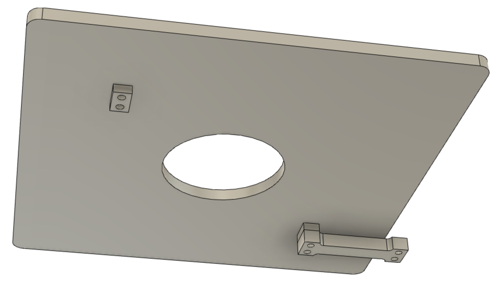
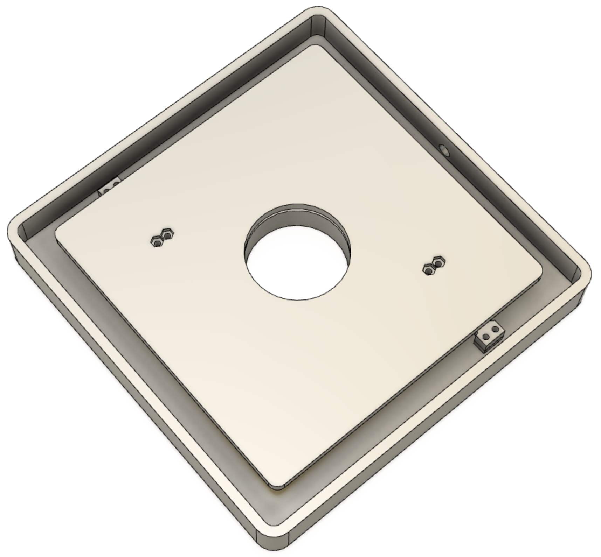
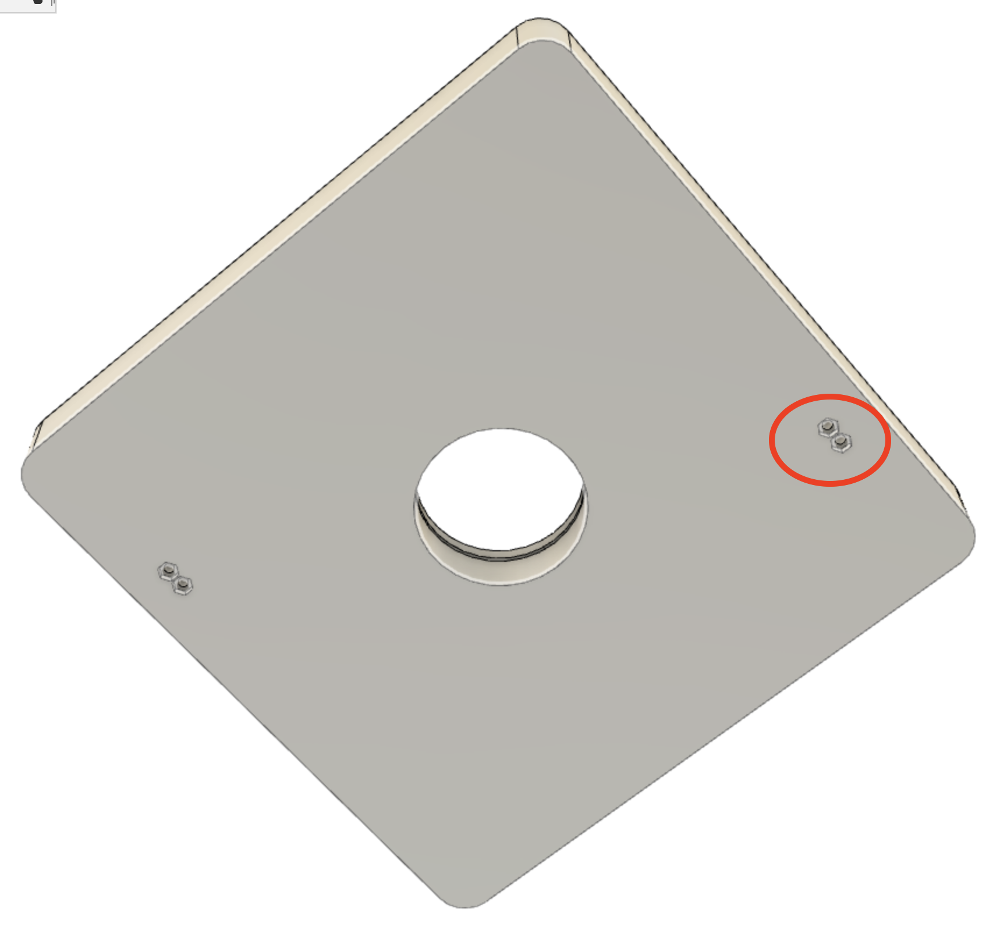

# PeaPod Assembly

> Rev. V0.1

# 0 - Prerequisites

## 0.1 - Materials

> The following are not included in the BOM (as of this revision), because it is assumed that everybody who will be assembling one of these has these already. If you are missing any of these, they are so widespread and general that you should be able to source them yourself fairly easily.

- Two (2) prototyping breadboards;
- Assorted-length breadboard wire;
- 12-volt power supply;
- Typical-guage (20-28AWG) solid-core wire;
- USB Micro Type B to USB Type A cable;
- Metric fasteners:
  - 8x M3x14 socket-head bolts;
  - 8x M4 hex nuts.

## 0.2 - Tools

- Wire strippers capable of 0.6mm dia. (22AWG);
- Metric Allan key set;
- Soldering iron, flux-core solder, etc. soldering tools -> **soldering station**;
- A 3D printer (with filament, duh).

## 0.3 - BOM Components

Purchase the [components BOM](../../hardware/bom/components_digikey.csv). This list is downloaded *directly* from [DigiKey's BOM Manager](https://www.digikey.ca/BOM), and you can import *directly* to that same web interface for purchasing.

# 1 - Fabrication

## 1.1 - 3D Printing

Print the following STLs (*PETG is recommended*):
- 1x [Scale Lower](printing/scale/scale_lower.stl), top-face on print bed;
- 1x [Scale Upper](printing/scale/scale_upper.stl), bottom-face on print bed;

## 1.2 - General Breakout Soldering

0. Prepare the following:
   - Soldering station;
   - Any breakout boards with loose/no headers;
   - Male header pins for those with no headers;

1. If any **breakout boards** come with loose/no headers (i.e. the Adafruit SHT31-D), solder those before starting.

> This does NOT apply to the K30 Extended Range CO2 Sensor. See [Section 1.3](#13---co2-sensor).

## 1.3 - CO2 Sensor

0. Prepare the following:
   - Soldering station;
   - Male header pins, 4-long;
   - K30 Extended Range CO2 Sensor.

1. Note the position of the 4 soldered pins on the K30 in the following image. From left-to-right, those pins are as follows:
   - `GND`
   - `VCC` (+12V)
   - `SCL`
   - `SDA`

2. Solder your 4 male header pin row to **the exact same 4 pins** on your K30.

# 2 - Assembly

## 2.1 - The Scale

> It is **IMPERATIVE** that you follow these steps in the order presented here. Deviation will result in frustration. Trust me.

0. Prepare the following:
   - 4x solid-core wire, stripped ends, ~20cm long;
   - Soldering station;
   - 1x Scale Lower, 1x Scale Upper
   - Allan key set
   - 8x M3x14 socket-head bolts;
   - 8x M4 hex nuts.

1. Seat 4 bolts loosely (i.e. hanging) in the two holes on the wire-free end of each load cell.

2. Fasten the load cells to the Scale Upper **from underneath** using 4 bolts and 4 nuts. Note the friction-fit hexagonal recesses on the top face for the nuts. Leave the wires dangling towards the center hole of the Scale Upper.

3. Strip the ends of the wires on the load cells.Solder each matching-colored pair of wires from the load cells to a length of wire (i.e. both green soldered to one wire).

4. Feed these 4 new wires out the round hole in the side of the Scale Lower.

5. Fasten the load cells to the Scale Lower using the 4 bolts *from Step 1* and 4 nuts. Note the friction-fit hexagonal recesses on the bottom face for the nuts. Ensure the wires are not in the way of the bezeled hole in the Scale Lower.

> See, I told you. Had you not left those 4 bolts hanging in Step 1, you'd be screwed now (pun intended), as the geometry of the top plate doesn't allow you to insert them *after* the top plate's been secured.

The scale is now assembled. Sticker optional.

## 2.2 - Breadboard Assembly

Wire components to breadboard according to the [breadboard schematic](../../hardware/schematics/breadboard_wiring.pdf).

Here's an example wiring:

# 3 - Programming

Attach the Micro USB to the Arduino Micro. Verify and upload the [PeaPod Arduino software](../../software/PeaPod-Arduino/) and interface with it by following the instructions in the Arduino software readme.