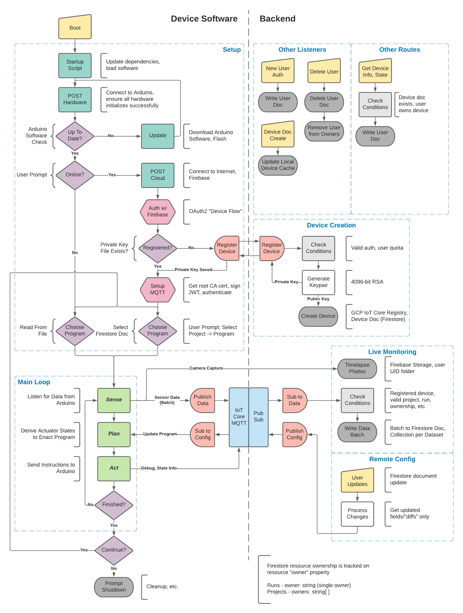

# PeaPodOS <!-- omit in toc -->

[](https://github.com/PeaPodTech/PeaPod/issues) [](https://github.com/PeaPodTech/PeaPod/issues?q=is%3Aissue+is%3Aclosed) [](https://github.com/PeaPodTechnologies/PeaPod/issues?q=is%3Aopen+is%3Aissue+label%3A%22Status%3A+Open%22)  [](https://www.youtube.com/watch?v=2zWv9JC5G3w) [](https://www.youtube.com/watch?v=k8xFbWLUDoQ)

<!-- TODO: Build Statuses? -->
 
A cloud-connected isolated and automated plant growth environment, able to generate any environment from a combination of independent environment parameters. 

Designed as both a hassle-free food production system and a research tool for precise and distributed mapping of the plant-environment relationship.

***
### Table of Contents
- [Background](#background)
- [Production](#production)
    - [Setting Up Raspberry Pi](#setting-up-raspberry-pi)
- [Development](#development)
    - [Arduino CLI - Compilation and Upload](#arduino-cli---compilation-and-upload)
    - [Raspberry Pi Serial Testing](#raspberry-pi-serial-testing)
    - [Build from Source](#build-from-source)
***

# Background

<a href="https://www.youtube.com/watch?v=2zWv9JC5G3w" target="_blank"></a>

***

# Production

### Setting Up Raspberry Pi

The following are performed on a computer:

1. Format a microSD card (>=4GB) with a single FAT partition.
2. Download the Raspberry Pi Imager [(Download)](https://www.raspberrypi.com/software/).
3. Flash the SD card with a *Raspberry Pi OS Lite* image.

> Note: In Future, a custom PeaPod image will be released with steps 5, 6, and 10 already complete.

4. Plug in a keyboard and display, insert the microSD card, and power the Raspberry Pi device.

The following are performed on the Raspberry Pi:

5. Login with the default username (`pi`) and password (`raspberry`).
6. Execute `sudo raspi-config` and perform these steps to setup the Pi:
   1. *System Options > Wireless Lan* - Setup WiFi and connect to the Internet
   2. *System Options > Hostname* - Set a unique host name (`e.g. john-peapod`)
   3. *System Options > Boot/Auto Login* - Select `Console Autologin`
   4. *Interface Options > SSH* - `Enable` SSH Server
   5. *Interface Options > Serial Port* - `Disable` serial login shell, but `Enable` the serial port hardware
   6. *Localisation Options > Locale* (i.e. `en_US.UTF-8`)
   7. *Localisation Options > Timezone* (i.e. `US` > `Eastern`)
   8. *Localisation Options > Keyboard* (i.e. `Generic 105-key` > `English (US)` > `Default` > `No compose key`)
   9. Optional: *Advanced Options > Expand Filesystem*
   10. Reboot to save: `sudo reboot` 

> You can now SSH into the Raspberry Pi to perform the rest of the setup (`ssh pi@peapod.local`, or with VS Code)

> Note: In Future, steps 7-9 will be automated at startup.
7. Update Packages:
     1. Update package listings, upgrade existing packages: `sudo apt-get update && sudo apt-get upgrade -y`
     2. Install Node.JS, the Node package manager, and *avrdude*: `sudo apt-get install -y nodejs npm avrdude` (could take a while)
     3. Install main software package: `sudo npm i -g @peapodtech/peapodos --save`

9.  Install and configure the Arduino CLI:
    1. Install with `curl -fsSL https://raw.githubusercontent.com/arduino/arduino-cli/master/install.sh | sh`. Successful output ends with something like:
      ```
      arduino-cli  Version: 0.21.0 Commit: 10107d24 Date: 2022-02-08T15:05:43Z installed successfully in /home/pi/bin
      ```
    2. Open `nano ~/.bashrc` and add this line to the bottom: `export PATH=$PATH:/home/pi/bin` (*Ctrl-O* to save, *Ctrl-X* to exit)
    3. Reboot to reset the path: `sudo reboot`
    4. Perform initial configuration: `arduino-cli config init`
    5. Update the list of cores: `arduino-cli core update-index`
    6. Install the AVR cores (incl. Arduino Nano/ATMega328P): `arduino-cli core install arduino:avr`

10. Create a custom configuration file for the AVR flash utility *avrdude* to be able to program the Arduino Nano via ICSP over the Raspberry Pi's GPIO pins:
   3.  Create a local copy of the *avrdude* configuration file with `cp /etc/avrdude.conf ~/avrdude_gpio.conf`, then modify your copy with `nano ~/avrdude_gpio.conf`. Copy the following to the end of the file:

       ```
       # Raspberry Pi GPIO configuration for avrdude.
       programmer
         id    = "peapod";
         desc  = "Use the Linux sysfs interface to bitbang GPIO lines";
         type  = "linuxgpio";
         reset = 5;
         sck   = 6;
         mosi  = 12;
         miso  = 13;
       ;
       ```
       (*Ctrl-O* to save, *Ctrl-X* to exit)
   4.  Verify the configuration and connection to the Arduino with `sudo avrdude -p m328p -C ~/avrdude_gpio.conf -c peapod -v`. A successful output should look something like:
       ```
       avrdude: Version 6.3-20171130
            Copyright (c) 2000-2005 Brian Dean, http://www.bdmicro.com/
            Copyright (c) 2007-2014 Joerg Wunsch

            System wide configuration file is "/home/pi/avrdude_gpio.conf"
            User configuration file is "/root/.avrduderc"
            User configuration file does not exist or is not a regular file, skipping

            Using Port                    : unknown
            Using Programmer              : peapod
            AVR Part                      : ATmega328P
            Chip Erase delay              : 9000 us
            PAGEL                         : PD7
            BS2                           : PC2
            RESET disposition             : dedicated
            RETRY pulse                   : SCK
            serial program mode           : yes
            parallel program mode         : yes
            Timeout                       : 200
            StabDelay                     : 100
            CmdexeDelay                   : 25
            SyncLoops                     : 32
            ByteDelay                     : 0
            PollIndex                     : 3
            PollValue                     : 0x53
            Memory Detail                 :

                                     Block Poll               Page                       Polled
              Memory Type Mode Delay Size  Indx Paged  Size   Size #Pages MinW  MaxW   ReadBack
              ----------- ---- ----- ----- ---- ------ ------ ---- ------ ----- ----- ---------
              eeprom        65    20     4    0 no       1024    4      0  3600  3600 0xff 0xff
              flash         65     6   128    0 yes     32768  128    256  4500  4500 0xff 0xff
              lfuse          0     0     0    0 no          1    0      0  4500  4500 0x00 0x00
              hfuse          0     0     0    0 no          1    0      0  4500  4500 0x00 0x00
              efuse          0     0     0    0 no          1    0      0  4500  4500 0x00 0x00
              lock           0     0     0    0 no          1    0      0  4500  4500 0x00 0x00
              calibration    0     0     0    0 no          1    0      0     0     0 0x00 0x00
              signature      0     0     0    0 no          3    0      0     0     0 0x00 0x00

            Programmer Type : linuxgpio
            Description     : Use the Linux sysfs interface to bitbang GPIO lines
            Pin assignment  : /sys/class/gpio/gpio{n}
              RESET   =  8
              SCK     =  11
              MOSI    =  10
              MISO    =  9

       avrdude: AVR device initialized and ready to accept instructions

       Reading | ################################################## | 100% 0.00s

       avrdude: Device signature = 0x1e950f (probably m328p)
       avrdude: safemode: lfuse reads as FF
       avrdude: safemode: hfuse reads as DA
       avrdude: safemode: efuse reads as FD

       avrdude: safemode: lfuse reads as FF
       avrdude: safemode: hfuse reads as DA
       avrdude: safemode: efuse reads as FD
       avrdude: safemode: Fuses OK (E:FD, H:DA, L:FF)

       avrdude done.  Thank you.
       ```

11. Edit the `sudoers` file to allow `avrdude` to be executed using `sudo` *without a password*:
    1.  Open the `sudoers` file: `sudo visudo`
    2.  Add the following line to the end (assuming your username is `pi`, the hostname is `peapod`, and the `avrdude` binary is located at `/usr/bin/avrdude`):
        
        `pi peapod = (root) NOPASSWD: /usr/bin/avrdude`
        
        (*Ctrl-O* to save, *Ctrl-X* to exit; *avrdude* can be located with `whereis avrdude`)

12. Import `.env` file with Firebase and auth keys (TBA), as well as the fields `SERIALPORT="/dev/ttyS0"` (Raspberry Pi Zero 2 W GPIO mini-UART) and `PASSWORD="raspberry"` with "raspberry" replaced with your password (used for `sudo` execution of *avrdude*).

13. Run the main program by executing `peapodos`.

<!-- https://github.com/nebrius/raspi-io/wiki/Getting-a-Raspberry-Pi-ready-for-NodeBots#configuring-your-app-to-start-on-startup -->

# Development

### Arduino CLI - Compilation and Upload

To manually compile and upload the test sketch `blink` to an Arduino Nano (ATMega328P aka `m328p`):
1. `arduino-cli compile -b arduino:avr:nano blink -e` 
  
    (`-b`: board FQBN, `-e`: export binary to sketch folder)

2. `sudo avrdude -p m328p -C ~/avrdude_gpio.conf -c peapod -v -U flash:w:blink/build/arduino.avr.nano/blink.ino.hex:i`

    (`-p`: microprocessor ID, `-C`: custom configuration file path, `-c`: programmer ID, `-v`: verify sketch after upload, `-U`: upload options and path to binary)

    Successful output should look like this:

    ```
    avrdude: Version 6.3-20171130
            Copyright (c) 2000-2005 Brian Dean, http://www.bdmicro.com/
            Copyright (c) 2007-2014 Joerg Wunsch

            System wide configuration file is "/home/pi/avrdude_gpio.conf"
            User configuration file is "/root/.avrduderc"
            User configuration file does not exist or is not a regular file, skipping

            Using Port                    : unknown
            Using Programmer              : peapod
            AVR Part                      : ATmega328P
            Chip Erase delay              : 9000 us
            PAGEL                         : PD7
            BS2                           : PC2
            RESET disposition             : dedicated
            RETRY pulse                   : SCK
            serial program mode           : yes
            parallel program mode         : yes
            Timeout                       : 200
            StabDelay                     : 100
            CmdexeDelay                   : 25
            SyncLoops                     : 32
            ByteDelay                     : 0
            PollIndex                     : 3
            PollValue                     : 0x53
            Memory Detail                 :

                                     Block Poll               Page                       Polled
              Memory Type Mode Delay Size  Indx Paged  Size   Size #Pages MinW  MaxW   ReadBack
              ----------- ---- ----- ----- ---- ------ ------ ---- ------ ----- ----- ---------
              eeprom        65    20     4    0 no       1024    4      0  3600  3600 0xff 0xff
              flash         65     6   128    0 yes     32768  128    256  4500  4500 0xff 0xff
              lfuse          0     0     0    0 no          1    0      0  4500  4500 0x00 0x00
              hfuse          0     0     0    0 no          1    0      0  4500  4500 0x00 0x00
              efuse          0     0     0    0 no          1    0      0  4500  4500 0x00 0x00
              lock           0     0     0    0 no          1    0      0  4500  4500 0x00 0x00
              calibration    0     0     0    0 no          1    0      0     0     0 0x00 0x00
              signature      0     0     0    0 no          3    0      0     0     0 0x00 0x00

            Programmer Type : linuxgpio
            Description     : Use the Linux sysfs interface to bitbang GPIO lines
            Pin assignment  : /sys/class/gpio/gpio{n}
              RESET   =  8
              SCK     =  11
              MOSI    =  10
              MISO    =  9

      avrdude: AVR device initialized and ready to accept instructions

      Reading | ################################################## | 100% 0.00s

      avrdude: Device signature = 0x1e950f (probably m328p)
      avrdude: safemode: lfuse reads as FF
      avrdude: safemode: hfuse reads as DA
      avrdude: safemode: efuse reads as FD
      avrdude: NOTE: "flash" memory has been specified, an erase cycle will be performed
               To disable this feature, specify the -D option.
      avrdude: erasing chip
      avrdude: reading input file "blink/build/arduino.avr.nano/blink.ino.hex"
      avrdude: writing flash (922 bytes):

      Writing | ################################################## | 100% 0.31s

      avrdude: 922 bytes of flash written
      avrdude: verifying flash memory against blink/build/arduino.avr.nano/blink.ino.hex:
      avrdude: load data flash data from input file blink/build/arduino.avr.nano/blink.ino.hex:
      avrdude: input file blink/build/arduino.avr.nano/blink.ino.hex contains 922 bytes
      avrdude: reading on-chip flash data:

      Reading | ################################################## | 100% 0.28s

      avrdude: verifying ...
      avrdude: 922 bytes of flash verified

      avrdude: safemode: lfuse reads as FF
      avrdude: safemode: hfuse reads as DA
      avrdude: safemode: efuse reads as FD
      avrdude: safemode: Fuses OK (E:FD, H:DA, L:FF)

      avrdude done.  Thank you.
    ```


### Raspberry Pi Serial Testing

To test the GPIO serial port (`/dev/ttyS0`), connect GPIO pins 8 and 10 (TX and RX) and execute the following:
1. Install the Python package manager *pip*: `sudo apt-get install pip`
2. Install the Serial package *pyserial*: `pip install pyserial`
3. Execute the test script: `python ~/PeaPod/software/tests/serialTest.py`

Correct output should look like:

```
Serial port '/dev/ttyS0' ready for test:
Sent 20 bytes: 'Testing Raspberry Pi GPIO serial port ...'
Received 20 bytes: 'Testing Raspberry Pi GPIO serial port ...'
Port '/dev/ttyS0' is is setup correctly!
```

### Build from Source

1. Install TypeScript language support and compiler, as well as a Node build tool: `sudo npm install -g typescript`
2. Clone source
3. Navigate to `software/` folder
4. Build the `serialport` package from source: `sudo npm install serialport --unsafe-perm --build-from-source`
5. Install all other Node dependencies: `npm i`
6. Compile the source with `tsc` and execute with `node .`