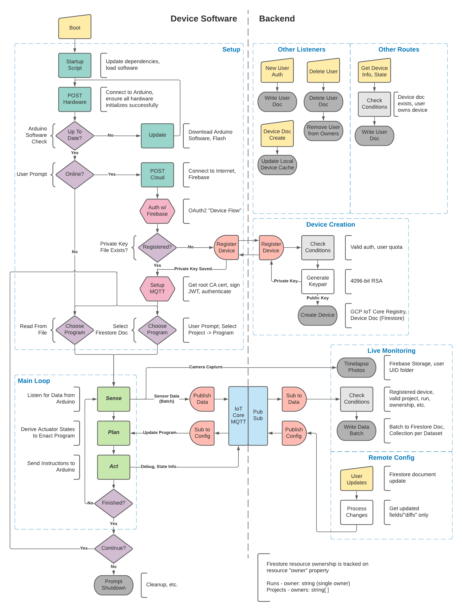

# PeaPodOS <!-- omit in toc -->

Main software for PeaPod.

### Table of Contents
- [Design](#design)
  - [Architecture](#architecture)
    - [environment](#environment)
    - [index](#index)
    - [server](#server)
- [Usage](#usage)
  - [Development](#development)
    - [Native Simulator Development](#native-simulator-development)
    - [Packing for NPM](#packing-for-npm)
    - [Exporting Software Bundle](#exporting-software-bundle)
    - [QEMU Raspberry Pi Simulator](#qemu-raspberry-pi-simulator)
  - [Production](#production)
    - [Build Raspberry Pi Image](#build-raspberry-pi-image)
    - [Raspberry Pi First-Time Setup](#raspberry-pi-first-time-setup)
  - [Installation](#installation)
  - [Execution](#execution)

# Design
 
A two-part system, consisting of a high-level software application and a low-level microcontroller firmware, designed for remote monitoring and configuration of control systems.

The software is written in TypeScript and runs on any compatible computer system with an internet connection, persistent storage, and a UART serial interface (i.e. Raspberry Pi Zero 2 W).

The firmware is written in Arduino C++ and runs on any compatible microcontroller system with UART serial and I2C interfaces (i.e. Adafruit ESP32 Feather V2). See `./microcontroller/README.md` for more information.

Ensure UART voltage levels are compatible (i.e. 3.3V for both Raspberry Pi Zero 2 W and Adafruit ESP32 Feather V2).



## Architecture

### environment

Priority:

1. User input
2. Command-line arguments
3. Environment variables
4. Defaults

### index
run tests, flash firmware, launch server

### server

start menu
- publishing mode selection (Local Filesytem, Firebase, Dashboard)
- Firebase Device Flow Authentication
  - Provider Selection (Google, GitHub)
  - Device Code & URL
- Microcontroller Serial Port Selection
- Dashboard Webserver Hostname & Port Selection

serial communication
- bidirectional
- JSON-formatted
- newline-delimited
- encoding: device commands, system configuration
- decoding: telemetry/debugging

WebSockets API w/ Callbacks
- camera capture and image streaming
- serial passthrough
- intervals
- linker
- firmware flashing
- scheduler

Control Systems (TODO)

dashboard webserver
- Debugging Console
- Telemetry Charts
- Calendar + DataGrid
- Interval & Event Scheduler
    - Microcontroller Instructions
    - Tasks

# Usage

## Development

There are three entrypoints:
1. Docker compose development environment for native simulator development
2. NPM package for development and publishing
3. Exported software bundle for development deployment

### Native Simulator Development

1. `git clone https://github.com/PeaPodTechnologies/PeaPod.git`
2. `cd software`
3. `chmod +x ./scripts/attach.sh`
4. `docker compose up`
5. In a separate terminal, `./scripts/attach.sh` to attach to the container and run the software.

### Packing for NPM

1. `git clone https://github.com/PeaPodTechnologies/PeaPod.git`
2. `cd software`
3. `chmod +x ./scripts/pack.sh`
4. `./scripts/pack.sh` to build the software and create a `.tgz` package in `./dist/peapodos.tgz` for publishing to NPM.

### Exporting Software Bundle

1. Execute `scripts/export.sh` WITH NO ARGUMENTS to compile TypeScript to JavaScript and bundle the webserver, creating an `./out.tar.gz` archive containing the compiled software.
2. Optional: Execute `scripts/upload.sh <hostname>` to upload the `./out.tar.gz` archive to the Raspberry Pi Zero 2 W home directory, where `<hostname>` is the hostname of the Raspberry Pi (e.g. `peapod.local`).
3. Unzip the `~/out.tar.gz` archive with `tar -xzf ~/out.tar.gz -C ~`.

### QEMU Raspberry Pi Simulator

1. Install dependencies: `brew install qemu`
2. Build the Raspberry Pi OS Lite (64-bit) QEMU-compatible image: `./qemu-image.sh`
3. Build the Docker image for the QEMU simulator: `./qemu-build.sh`
4. Run the QEMU simulator container with `./qemu-run.sh deploy/<date>-peapod-lite-qemu.img` to install boot the Raspberry Pi OS Lite (64-bit) image in a virtual machine.

## Production

This targets Raspberry Pi Zero 2 W with GPIO UART serial connection to an Adafruit ESP32 Feather V2 microcontroller.

### Build Raspberry Pi Image

The following are performed on a computer with an internet connection, Docker, and Homebrew installed:

1. Format a microSD card (>=32GB) with a single FAT partition.
2. Download the Raspberry Pi Imager [(Download)](https://www.raspberrypi.com/software/).
3. Build the Raspberry Pi OS Lite (64-bit) image: `build.sh`. This creates a Docker build container that produces a `.zip` file at `deploy/*.zip`. This requires Homebrew and installs `gnu-sed`.
4. Flash the SD card with the Raspberry Pi OS Lite (64-bit) image using Raspberry Pi Imager, and select `deploy/*.zip` as the custom image.

> Note: A custom PeaPodOS image will be released in the future.

### Raspberry Pi First-Time Setup

1. Plug in a keyboard and display, insert the microSD card, and power on the Raspberry Pi Zero 2 W.

The following are performed on the Raspberry Pi Zero 2 W, with a keyboard and monitor:

2. Login.
3. Execute `sudo raspi-config` and perform these steps to setup the Pi:
   1. *System Options > Wireless Lan* - Setup WiFi and connect to the Internet (if not set from within imager)
   2. *System Options > Hostname* - Set a unique hostname, e.g. `peapod` (if not set from within imager)
   3. *System Options > Boot/Auto Login* - Select `Console Autologin` (B2)
   4. *Interface Options > SSH* - `Enable` SSH Server (if not set from within imager)
   5. *Interface Options > Serial Port* - `Disable` serial login shell, but `Enable` the serial port hardware
   6. *Performance Options > GPU Memory* - 256 MB (to support the camera module, if used)
   7. *Localisation Options > Locale* (i.e. `en_US.UTF-8`)
   8. *Localisation Options > Timezone* (i.e. `US` > `Eastern`)
   9. *Localisation Options > Keyboard* (i.e. `Generic 105-key` > `English (US)` > `Default` > `No compose key`)
   10. Optional: *Advanced Options > Expand Filesystem*
   11. Reboot to save: `sudo reboot -f` 

> You can now SSH into the Raspberry Pi to perform the rest of the setup, or continue with the keyboard and monitor.

## Installation

1. Update package listings, upgrade existing packages: `sudo apt update && sudo apt full-upgrade -y`

2. Install Node.JS, the Node package manager, and Python dependencies: `sudo apt install -y nodejs npm python3-venv python3-dev`
<!-- 3. Install main software package: `sudo npm i -g @peapodtech/peapodos --save` -->
<!-- 4. If using a Raspberry Pi Camera, install the camera package: `sudo apt install -y libcamera-apps` -->

3. Install [PlatformIO Core](https://docs.platformio.org/en/latest/core/installation/methods/installer-script.html#super-quick-macos-linux)
<!-- 
1. Create a custom configuration file for the AVR flash utility *avrdude* to be able to program the Arduino Nano via ICSP over the Raspberry Pi's GPIO pins:
   1.  Create a local copy of the *avrdude* configuration file with `cp /etc/avrdude.conf ~/avrdude_gpio.conf`, then modify your copy with `nano ~/avrdude_gpio.conf`. Copy the following to the end of the file:

       ```
       # Raspberry Pi GPIO configuration for avrdude.
       programmer
         id    = "peapod";
         desc  = "Use the Linux sysfs interface to bitbang GPIO lines";
         type  = "linuxgpio";
         reset = 5;
         sck   = 6;
         mosi  = 12;
         miso  = 13;
       ;
       ```
       (*Ctrl-O* to save, *Ctrl-X* to exit)
   2.  Verify the configuration and connection to the Arduino with `sudo avrdude -p m328p -C/avrdude_gpio.conf -c peapod -v`. A successful output should look something like:
       ```
       avrdude: Version 6.3-20171130
            Copyright (c) 2000-2005 Brian Dean, http://www.bdmicro.com/
            Copyright (c) 2007-2014 Joerg Wunsch

            System wide configuration file is "/home/pi/avrdude_gpio.conf"
            User configuration file is "/root/.avrduderc"
            User configuration file does not exist or is not a regular file, skipping

            Using Port                    : unknown
            Using Programmer              : peapod
            AVR Part                      : ATmega328P
            Chip Erase delay              : 9000 us
            PAGEL                         : PD7
            BS2                           : PC2
            RESET disposition             : dedicated
            RETRY pulse                   : SCK
            serial program mode           : yes
            parallel program mode         : yes
            Timeout                       : 200
            StabDelay                     : 100
            CmdexeDelay                   : 25
            SyncLoops                     : 32
            ByteDelay                     : 0
            PollIndex                     : 3
            PollValue                     : 0x53
            Memory Detail                 :

                                     Block Poll               Page                       Polled
              Memory Type Mode Delay Size  Indx Paged  Size   Size #Pages MinW  MaxW   ReadBack
              ----------- ---- ----- ----- ---- ------ ------ ---- ------ ----- ----- ---------
              eeprom        65    20     4    0 no       1024    4      0  3600  3600 0xff 0xff
              flash         65     6   128    0 yes     32768  128    256  4500  4500 0xff 0xff
              lfuse          0     0     0    0 no          1    0      0  4500  4500 0x00 0x00
              hfuse          0     0     0    0 no          1    0      0  4500  4500 0x00 0x00
              efuse          0     0     0    0 no          1    0      0  4500  4500 0x00 0x00
              lock           0     0     0    0 no          1    0      0  4500  4500 0x00 0x00
              calibration    0     0     0    0 no          1    0      0     0     0 0x00 0x00
              signature      0     0     0    0 no          3    0      0     0     0 0x00 0x00

            Programmer Type : linuxgpio
            Description     : Use the Linux sysfs interface to bitbang GPIO lines
            Pin assignment  : /sys/class/gpio/gpio{n}
              RESET   =  8
              SCK     =  11
              MOSI    =  10
              MISO    =  9

       avrdude: AVR device initialized and ready to accept instructions

       Reading | ################################################## | 100% 0.00s

       avrdude: Device signature = 0x1e950f (probably m328p)
       avrdude: safemode: lfuse reads as FF
       avrdude: safemode: hfuse reads as DA
       avrdude: safemode: efuse reads as FD

       avrdude: safemode: lfuse reads as FF
       avrdude: safemode: hfuse reads as DA
       avrdude: safemode: efuse reads as FD
       avrdude: safemode: Fuses OK (E:FD, H:DA, L:FF)

       avrdude done.  Thank you.
       ``` -->

<!-- 11. Edit the `sudoers` file to allow `avrdude` to be executed using `sudo` *without a password*:
    1.  Open the `sudoers` file: `sudo visudo`
    2.  Add the following line to the end (assuming your username is `pi`, the hostname is `peapod`, and the `avrdude` binary is located at `/usr/bin/avrdude`):
        
        `pi peapod = (root) NOPASSWD: /usr/bin/avrdude`
        
        (*Ctrl-O* to save, *Ctrl-X* to exit; *avrdude* can be located with `whereis avrdude`) -->

<!-- 12. Install the *UV4L* camera library:
    1.  `curl https://www.linux-projects.org/listing/uv4l_repo/lpkey.asc | sudo apt-key add -`
    2.  Add the package listings: `echo "deb https://www.linux-projects.org/listing/uv4l_repo/raspbian/stretch stretch main" | sudo tee /etc/apt/sources.list.d/uv4l.list`
    3.  Update packages: `sudo apt-get update`
    4.  Install the core library, the Raspberry Pi driver, extra scripts, adn WebRTC support: `sudo apt-get install uv4l uv4l-raspicam uv4l-raspicam-extras uv4l-webrtc-armv6` -->

4.  Populate a `~/.env` file based on `./.env.template` with Firebase configuration, Google and/or GitHub auth configuration, serial port configuration, and webserver configuration (if applicable).

5.  Unpack the `~/out.tar.gz` archive to the home directory: `tar -xzf ~/out.tar.gz -C ~`

6.  Connect a USB cable from the computer (i.e. Raspberry Pi Zero 2 W) to the microcontroller (i.e. Adafruit ESP32 Feather V2), and verify that the serial port is available and openable by executing `node ~/serialtest.mjs` and following the prompts. The serial port should be something like `/dev/ttyACM0` (NOT `/dev/ttyS0`, this is the GPIO UART).

7.  Perform first-time microcontroller firmware flashing by executing `node ~/flash.mjs` and following the prompts. The serial port should be something like `/dev/ttyACM0` (NOT `/dev/ttyS0`, this is the GPIO UART).

## Execution

1. Run the main program by executing `node ~/server.mjs`.

2. Follow the prompts to select a publishing mode (Local Filesystem, Firebase, and/or Dashboard), and if applicable, perform Firebase Device Flow Authentication.

3. The webserver should start, making the dashboard accessible at the displayed hostname and port.

4. Select the appropriate serial port (i.e. `/dev/ttyS0` for GPIO UART-Arduino `Serial1`, `/dev/ttyACM0` for USB-Arduino `Serial`) to connect to the microcontroller.

5. The console will begin printing raw telemetry and debugging information from the microcontroller.

<!-- https://github.com/nebrius/raspi-io/wiki/Getting-a-Raspberry-Pi-ready-for-NodeBots#configuring-your-app-to-start-on-startup -->